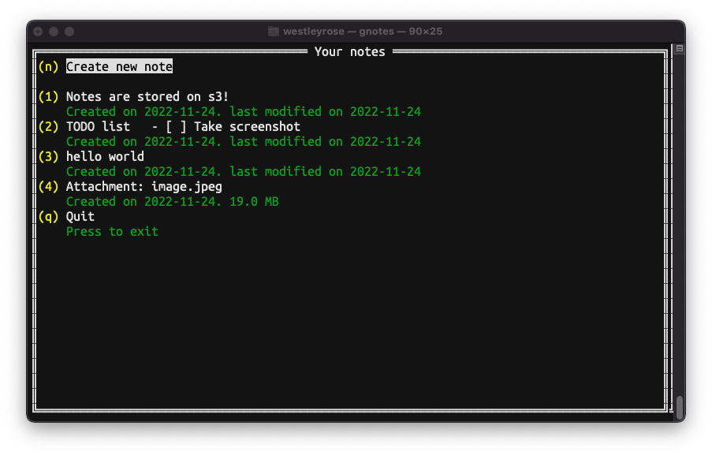

# GNOTES - Terminal based S3 syncing note app



**A WIP app. This is my local code and may not work for you. But you may
find this useful.**

Before using, you need access to a S3 server. Otherwise it will only save notes
locally, and may not work correctly.

## How it works

GNOTES syncs all notes and attachments to a s3 server. v1 branch will store all
notes (not attachments) in one tarball. Every note is contained into that one
file. With v2, each note is a seprate file on s3. This greatly improves download
and upload speed when saving notes. Also, each note is checked with a sha1sum
checksum to avoid downloading the notes if its already cached locally.

In v2, all notes and attachments are compressed, and encrypted before uploading
to the s3 server.

Eventually, v3 will be diff based, further improving download and upload speed,
and able to keep some revisions.

## Installation

```
$ git clone https://github.com/WestleyR/gnotes
$ cd gnotes/
$ make
$ cp gnotes ~/.local/bin  # or your preferred path
```

## Setting up gnotes for your S3 server

See the [`config.ini`](./config.ini) file for an example config.

The user config file for gnotes is located in:

```
${HOME}/.config/gnotes/config.ini
```

And as an example, for dreamhost, it should look like this:

```ini
[settings]
editor = vim
notes_dir = ${HOME}/.config/gnotes


[s3]
active = true
bucket = gnotes-v2
endpoint = https://objects-us-east-1.dream.io
region = us-east-1
accesskey = ACCESS_KEY
secretkey = SECRET_KEY
user_id = a-one-time-generated-uuid
crypt_key = a-16-bit-token
```

## Inital creation

Right after installing, or if you dont have any gnote data on the s3 server,
gnotes will likely print error messages. For safey reasions, if it failed to
download data, it will not continue to avoid losing data. 

After a fresh install, you first need to run gnotes with these flags:

```
$ gnotes -s -R
```

Then create a new note with some content.

The `-s` tells gnotes to skip the download, and `-R` for not looking for local
cache.

Run `gnotes --help` for other flags or help.

**After the inital creation, do not use those flags. Otherwise you may lose
data**

## Basic usage

To delete a note, just select it with the ui and delete all content with your
editor. With vim type `:%d` as an example. Then save, exit, and it will be
deleted. Make sure all lines are removed.

## Bugs

This is in develpment, there may be bugs. Please report by opening a github
issue.

